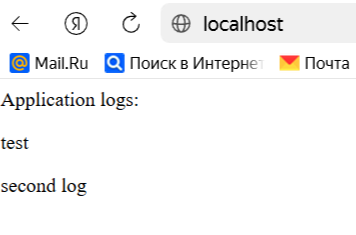
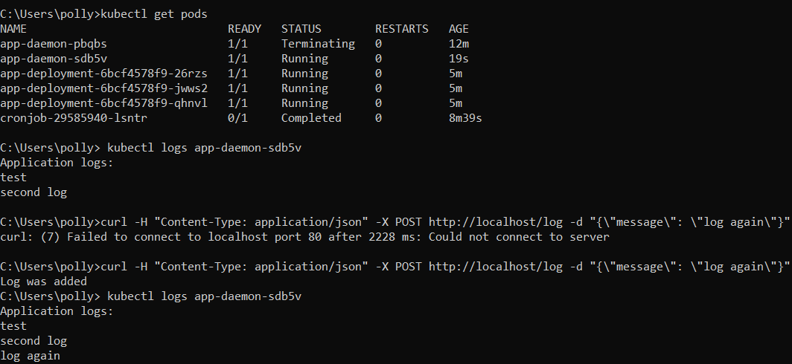
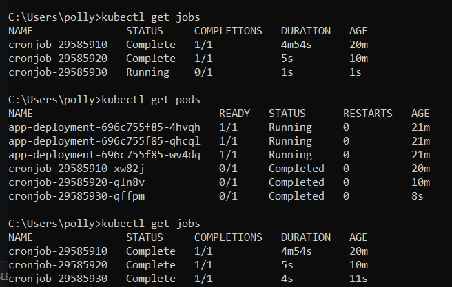

После создания deployment и выполнения команды `kubectl port-forward service/app-service 80` проверяем работу приложения через `curl`.

  

Также можно зайти на web-страницу:

Поменяем приветственное сообщение в <i>config.yaml</i> и перезапустим deployment: `kubectl rollout restart deployment/app-deployment`.

Приветственное сообщение изменилось. Теперь проверим работу daemon после добавления нескольких сообщений в <i>app.log</i>.

Также можно посмотреть, выполняются ли `cronjobs`:

