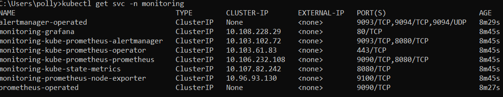
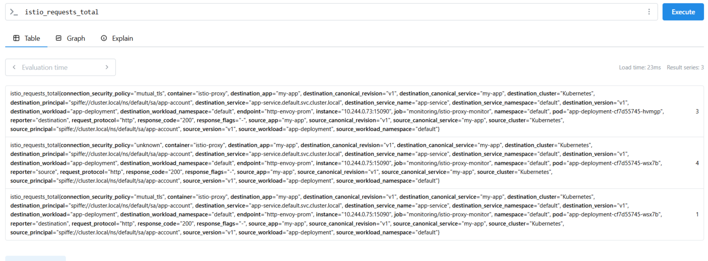
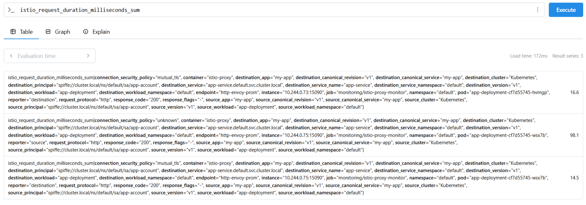
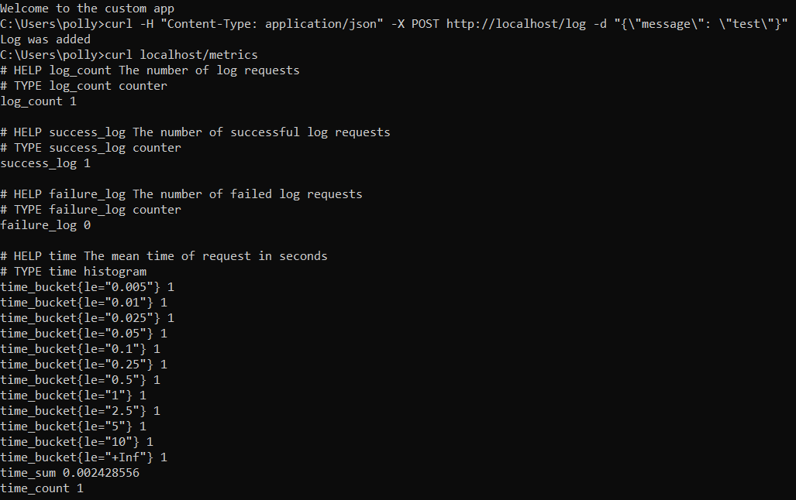
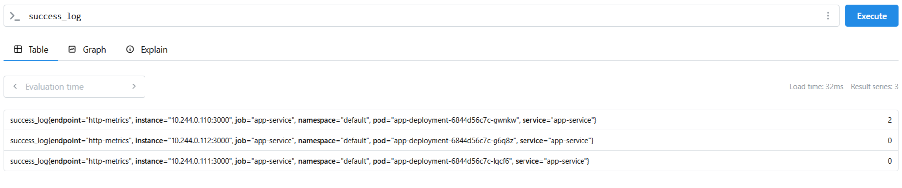
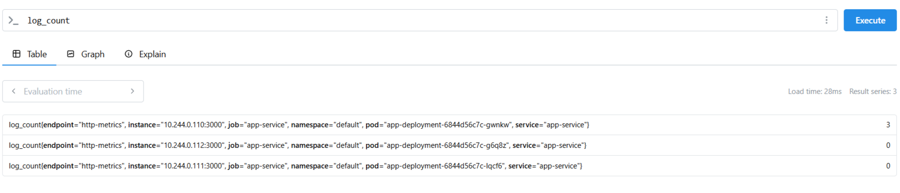
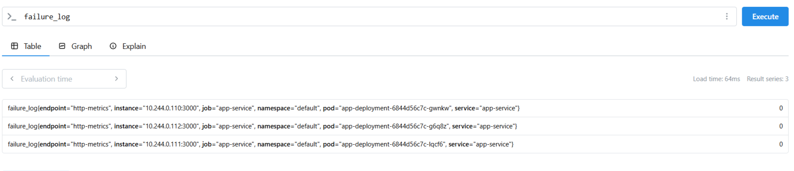
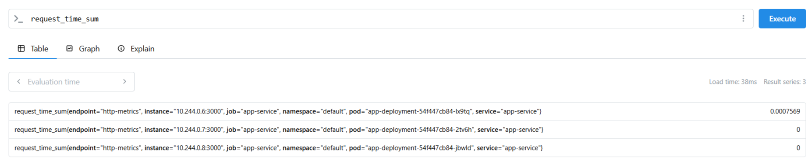

Устанавливаем prometheus и настраиваем возможность использовать ServiceMonitor из разных пространств имён:

```sh

helm repo add prometheus-community https://prometheus-community.github.io/helm-charts
helm repo update

helm install monitoring prometheus-community/kube-prometheus-stack \
  --namespace monitoring \
  --create-namespace \
  --set prometheus.prometheusSpec.serviceMonitorSelectorNilUsesHelmValues=false \
  --set prometheus.prometheusSpec.podMonitorSelectorNilUsesHelmValues=false

```
Проверяем установку:



Делаем несколько запросов в приложение командой `curl localhost` и смотрим на метрики istio:





Настраиваем ServiceMonitor, затем добавляем несколько записей в logs: `curl -H "Content-Type: application/json" -X POST http://localhost/log -d "{\"message\": \"test\"}"`.



Проверяем наличие пользовательских метрик, определённых в файле `backend/index.js`.






